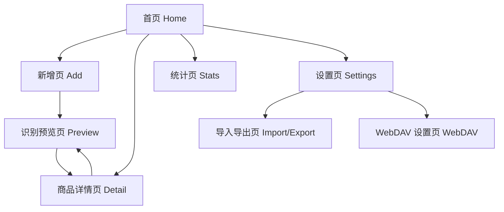

# PickIt 信息架构

## 1. 顶层导航

底部导航固定 3 个主入口：

- 首页
- 统计
- 设置

全局悬浮主按钮：

- 新增商品

二级页面通过栈式导航进入：

- 新增页
- 识别预览页
- 商品详情页
- 导入导出页
- WebDAV 设置页

## 2. 页面地图

## 3. 首页信息层级

### 一级信息

- 搜索框
- 筛选条
- 商品列表
- 新增入口

### 二级信息

- 当前筛选状态
- 排序模式
- 空态提示
- 最近新增提示

### 单卡片最小信息集

- 商品标题
- 平台
- 当前价格
- 状态
- 标签 1~3 个
- 更新时间或新增时间

## 4. 新增与预览链路结构

## 5. 详情页信息层级

### 顶部

- 商品标题
- 平台与店铺
- 当前状态
- 编辑入口

### 中部

- 当前价格
- 推荐摘要
- 标签区域
- 来源备注

### 下部

- 价格历史列表
- 识别信息与置信度
- 最近更新时间

## 6. 设置域结构

### 设置首页分组

- 识别服务
- 备份与同步
- 导入导出
- 本地存储
- 关于应用

### 备份与同步二级结构

- WebDAV 地址与账号
- 连接测试
- 手动备份
- 手动恢复
- 自动备份开关
- 最近备份记录

## 7. 数据对象与界面映射

| 数据对象 | 首页 | 预览页 | 详情页 | 统计页 | 设置页 |
|---|---|---|---|---|---|
| ProductItem | 主体 | 编辑前草稿 | 主体 | 聚合统计 | 否 |
| Tag | 筛选、卡片标签 | 编辑 | 标签区域 | 热门标签 | 否 |
| PriceHistory | 简要价格 | 初次生成 | 价格历史 | 波动统计 | 否 |
| ParseLog | 否 | 识别反馈 | 调试信息可选 | 否 | 否 |
| SyncConfig | 否 | 否 | 否 | 否 | 主体 |

## 8. 导航规则

- 从首页进入详情后，返回应保留原搜索词和筛选条件
- 从新增页进入预览页，保存成功后默认落到新商品详情页
- 预览页返回新增页时，需要保留用户已填备注
- 设置域所有操作完成后回到原二级页，不强制跳首页
