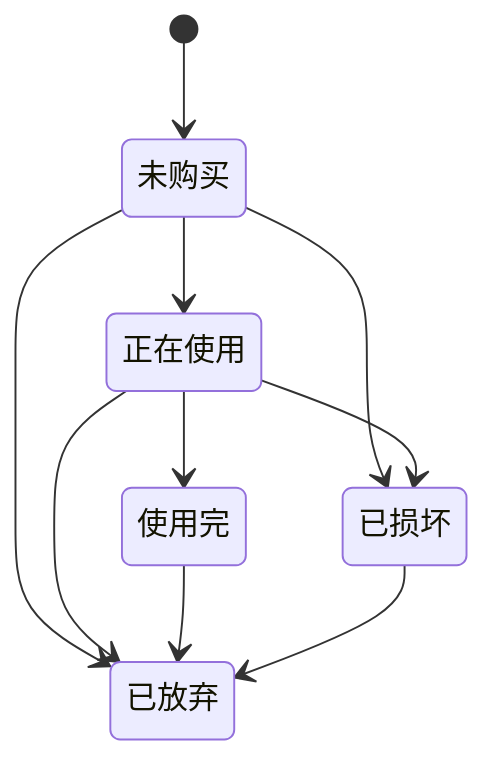

# PickIt 关键用户流

## 1. 图片录入主流程

### 目标

尽可能少打字，把截图快速变成可搜索商品。

### 流程

1. 用户点击首页右下角新增按钮
2. 选择拍照或相册导入
3. 可选填写一句来源备注，如“抖音直播间看到的厨房收纳盒”
4. 点击“开始识别”
5. 进入识别中状态页，展示进度与提示文案
6. 进入识别预览页，系统预填标题、平台、价格、标签等
7. 用户修正错误字段，补充状态和备注
8. 点击“确认保存”
9. 跳转详情页并提示“已加入收藏”

### 关键交互要求

- 图片选中后立即显示缩略预览，但不承诺长期保存
- 置信度低于 0.6 的字段默认高亮提醒
- “确认保存”按钮固定底部，单手可达

## 2. 搜索与筛选流程

### 目标

用户可以用模糊记忆快速找回商品。

### 流程

1. 用户在首页搜索框输入关键词
2. 系统实时执行本地模糊搜索
3. 用户通过平台、状态、标签、价格区间继续筛选
4. 列表即时更新
5. 点击卡片进入详情页

### 关键交互要求

- 搜索为空时展示默认收藏列表
- 无结果时给出可执行建议，而不是只显示“0 结果”
- 筛选激活后要显示可见的数量徽标和“清空”动作

## 3. 状态更新流程

### 目标

帮助用户把收藏变成长期可管理清单。

### 流程

1. 用户进入详情页
2. 点击当前状态胶囊
3. 打开底部操作表
4. 选择新状态
5. 即时更新，并在统计页同步反映

### 状态流转建议

## 4. 备份恢复流程

### 手动备份

1. 进入设置页
2. 点击“备份与同步”
3. 查看最近备份时间
4. 点击“立即备份”
5. 展示成功结果、文件位置、耗时

### 手动恢复

1. 进入备份与同步页
2. 点击“从 WebDAV 恢复”或“本地导入”
3. 二次确认覆盖风险
4. 执行恢复
5. 展示恢复结果和冲突提示

### 风险控制

- 恢复操作必须二次确认
- 失败时保留详细错误文案与重试入口
- 最近一次成功备份时间必须常驻可见

## 5. 关键状态设计

### 首页空态

- 文案方向：还没有收藏，先从一张截图开始
- 主按钮：去新增

### 搜索无结果

- 文案方向：没找到相关商品，试试品牌、平台或标签
- 辅助动作：清空筛选

### 识别中

- 文案方向：正在提取商品信息，请稍等几秒
- 不展示假的百分比；仅展示阶段性状态更可信

### 识别失败

- 文案方向：这次没有成功识别，你可以重试或直接手动填写
- 操作：重新识别、手动录入

### 保存成功

- 采用轻 toast + 页面跳转，而不是阻塞式弹窗
